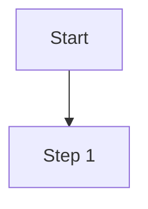
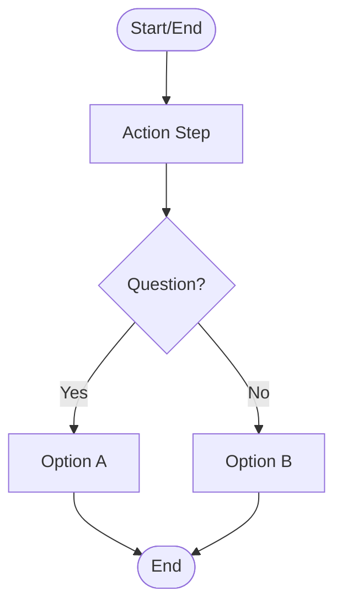

# Maintaining and Updating Diagrams

## Overview

This guide explains how to maintain and update the process flowcharts and diagrams in this documentation. The diagrams are created using Mermaid, a text-based diagramming tool that renders directly in GitHub.

## When to Update

Update diagrams when:

- Process workflows change (steps added, removed, or reordered)
- Users report confusion about a step or decision point
- Errors or inaccuracies are identified
- Better clarity or accessibility is needed

## How to Update

### 1. Locate the Diagram

Find the Mermaid code block in the documentation file. It will look like this:

````markdown

````

### 2. Edit the Diagram

**Using GitHub Web Editor:**

1. Click the pencil icon (Edit this file) on the documentation page
2. Modify the Mermaid syntax between the code blocks
3. Click the Preview tab to see your changes rendered
4. Commit with a descriptive message like "Update [process] diagram: [what changed]"

**Using Local Development:**

1. Clone the repository and create a branch
2. Edit the Mermaid syntax in your text editor
3. Preview using [Mermaid Live Editor](https://mermaid.live) or a VS Code Mermaid extension
4. Commit and push your changes

### 3. Test Your Changes

Before submitting:

- Verify the diagram renders correctly in GitHub preview
- Check that all connections and labels are accurate
- Ensure the flow matches the actual process
- Confirm labels are clear and concise

## Quick Syntax Reference

### Common Mermaid Elements



**Node types:**

- `([...])` - Start/End (rounded)
- `[...]` - Process step (rectangle)
- `{...}` - Decision point (diamond)

**Connections:**

- `-->` - Arrow
- `-->|text|` - Labeled arrow

## Best Practices

- **Be clear**: Use action-oriented labels ("Submit Form" not "Submission")
- **Be concise**: Keep node text short
- **Be consistent**: Use the same shapes for the same purposes across all diagrams
- **Be accessible**: Ensure labels are meaningful for screen readers

## Troubleshooting

**Diagram won't render?**

- Check that all brackets are properly matched
- Copy your code to [Mermaid Live Editor](https://mermaid.live) to find syntax errors
- Use quotes around text with special characters: `["Text: with special chars"]`

**Diagram too complex?**

- Break into multiple smaller diagrams
- Remove unnecessary detail
- Focus on the main workflow

## Resources

Need more help? Consider checking out these resources:

- [Mermaid Documentation](https://mermaid.js.org/)
- [Mermaid Live Editor](https://mermaid.live) - Test diagrams before committing
