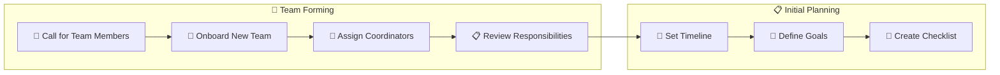
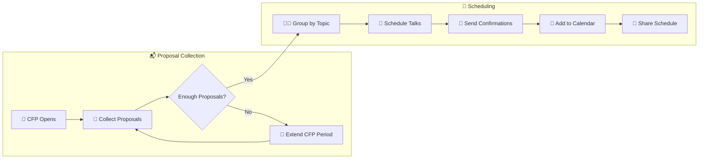
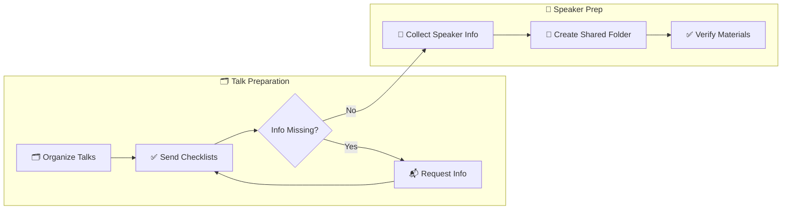
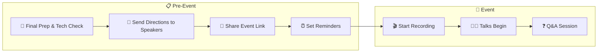

## Overview

The function of the Lightning Talks Event is to allow opportunities for members of the community to have an intimate space to present on a tech topic for 5-15 minutes. When live-streaming as a members-only event, speakers can feel more comfortable as it's _their_ community listening and watching. However, their is still opportunity to impact a larger audience once the videos have been processed and put up on YouTube.

Below is the workflow for the Lightning Talks Event.

### Timeline {#timeline-section}

#### Call for coordinators, mentors, and other teammates

  
📊 View Planning Phase Diagram

  

  

- Happens before the cfp to create a smoother onboarding process
- Roles are clarified and onboarding occurs (specify what this looks like)
  - Early assign coordinators based on input (ie, Bekah will take Group 1)
    - This will allow quick response times.
- Team meeting

### CFP (Call For Proposals)

  
📋 View CFP Process Diagram

  

  

- This should end at least six weeks before the event.
- Start with a date and time TBA during proposal stage.
  - Ask in form if there are any times that don't work on that day.
- Make sure everyone fills out the form (which creates a Github issues)
- As soon as cfp closes, team lead creates groups
  - Who makes the initial contact? And via email or slack? -- this should be specified in the form. Maybe that's a question for the form?

#### Organizing talks

  
🎤 View Speaker Preparation Process

  

  

- Create big issue cards for each coordinator with checklist, but smaller chunks on Project board more closely tied to time (ie, collect initial info (bio, headshot, socials), one week from date (title, description, slides)
  - All of information should be in one central document or folder.
    - Within that folder, there is a checklist that has each category (initial info checklist, talk checklist, etc.)
    - Update checklist for each speaker (if they don't have slides, delete that section)
      -???? SHould the speaker be dropping them into that central location and the coordinator checks it off???
- Coordinators can check it off as they go and all the info will be in one place.

##### Week of

  
🎭 View Event Day Process

  

  

- Send message to speaker channel with direction the week of - Let them know there's a lag between the stream and the speaker - Ask them to mute or better yet, hide your youtube stream
  (For ref: Bc there is a lag, if you’re watching and up next, you’ll be introduced before the next talk is over.)

### Communication {#communication-section}

#### For LT Team

- slack for quick communication and decisions and/or hype
- Discussions for conversations that should be preserved and talked through

#### With Speakers

- Slack -> Reminders, day of communication, a coordinator does fun things to get the speakers to use that private room
